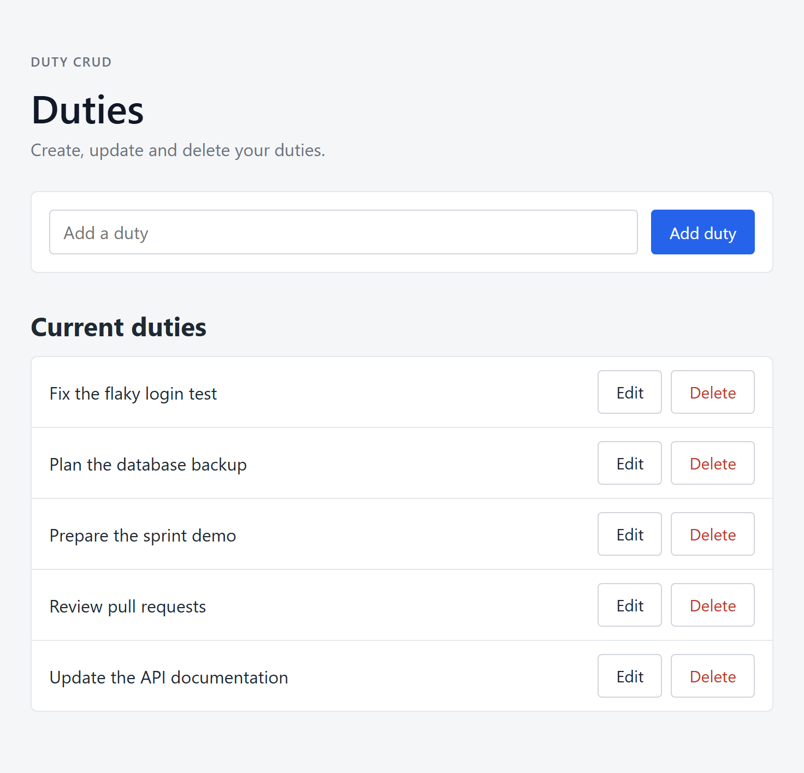
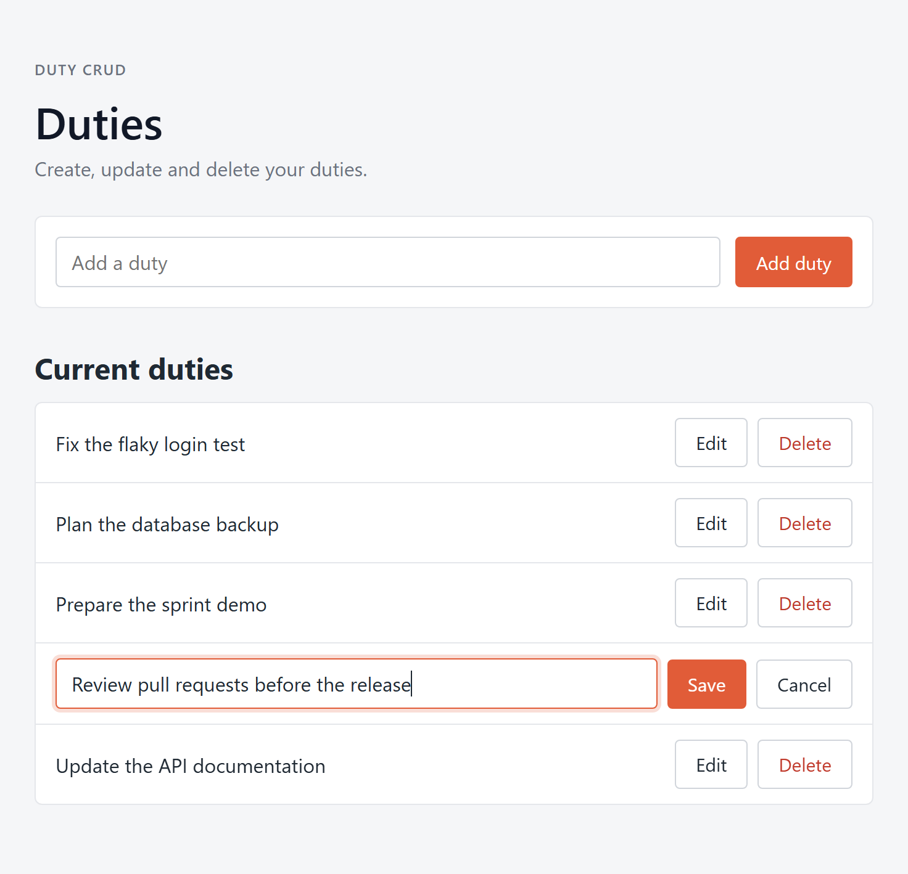
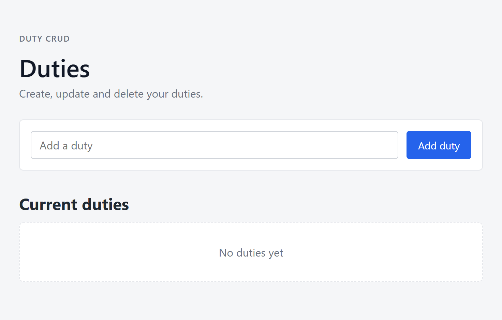
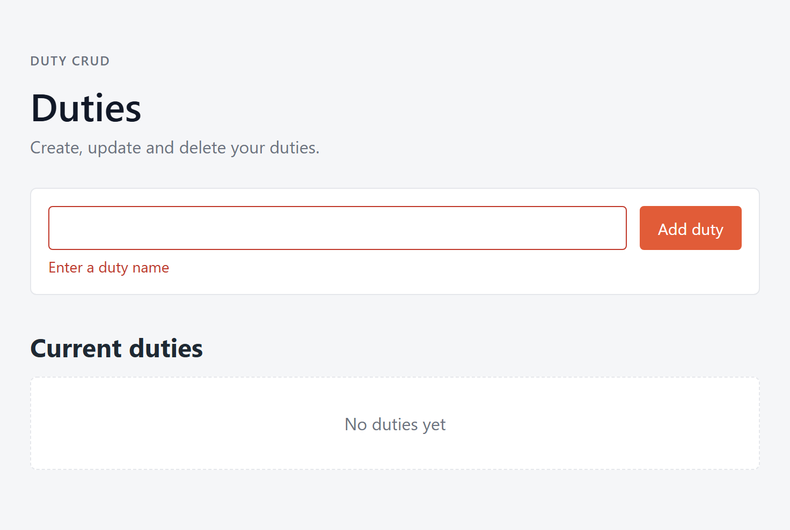
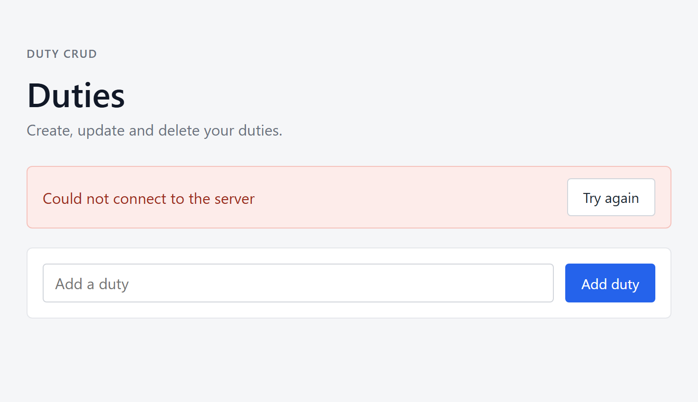
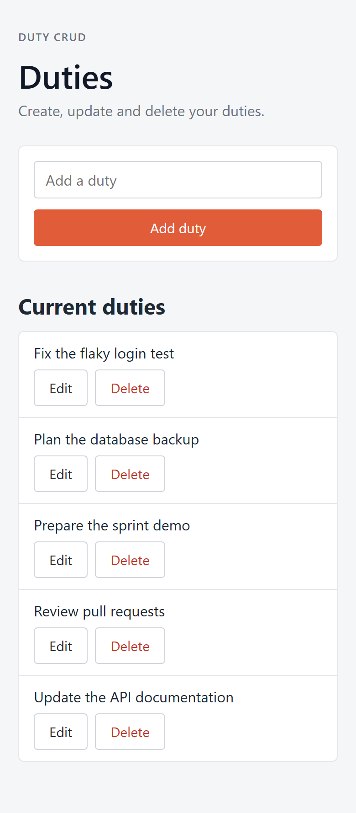

# Duty CRUD — Technical Assessment

End-to-end application to **read, create, update and delete** a list of duties. The domain is small on purpose; the focus is a clean structure that can grow, correct error handling and tests.

- **Frontend** — React 18 + TypeScript (strict), Vite, `useState` hooks, plain HTML and CSS.
- **Backend** — Node.js + TypeScript (strict), Express 5, `pg` with plain parameterised SQL (no ORM).
- **Database** — PostgreSQL 14+.
- **Validation** — `zod` in both projects, plus a `CHECK` constraint in the table.
- **Logs** — structured JSON with `pino`.
- **Tests** — Jest: 32 backend and 31 frontend tests.

---

## Quick start

**Prerequisites:** Node.js 20.12+ and PostgreSQL 14+.

```bash
npm install                                                    # installs backend and frontend (npm workspaces)
psql -U postgres -d postgres -f backend/database/schema.sql    # creates the table
cp backend/.env.example backend/.env                           # Windows: copy backend\.env.example backend\.env
npm run dev                                                    # API on :3000, app on http://localhost:5173
```

| Command | What it does |
|---|---|
| `npm run dev` | Starts backend and frontend together |
| `npm test` | Runs all tests (no database needed) |
| `npm run build` | Builds `backend/dist` and `frontend/dist` |
| `npm start --workspace backend` | Runs the compiled API |
| `npm run preview --workspace frontend` | Serves the compiled frontend |

All scripts work on Windows, macOS and Linux.

### Environment variables

| Project | Variable | Default |
|---|---|---|
| backend | `DATABASE_URL` | **required** |
| backend | `PORT` | `3000` |
| backend | `FRONTEND_URL` (CORS origin) | `http://localhost:5173` |
| backend | `LOG_LEVEL` | `info` |
| frontend | `VITE_API_URL` | `http://localhost:3000/api` |

The backend validates them with zod at startup and refuses to start if one is missing or invalid.

---

## Screenshots

| Duties list | Editing a duty |
|---|---|
|  |  |

| Empty state | Client-side validation |
|---|---|
|  |  |

| Backend not reachable | Mobile |
|---|---|
|  |  |

---

## Architecture

Two independent projects in one repository. The frontend never imports backend code; they only share the HTTP API.

```
Backend   routes → controller → service → repository → PostgreSQL
Frontend  components → useDuties hook → duty.service → api-client (fetch) → API
```

- **Controller** reads the request, validates it with zod and picks the status code.
- **Service** holds the business rules (e.g. not found → 404) and business logs.
- **Repository** is the only place with SQL.
- **api-client** is the only place that calls `fetch`; it checks `response.ok` and turns backend errors into readable messages.

```
backend/
├── database/schema.sql
└── src/
    ├── index.ts, app.ts          # server start / Express app
    ├── config/                   # env (zod) and PostgreSQL pool
    ├── duties/                   # routes, controller, service, repository, validation, model
    ├── middlewares/              # cors, request logger, not found, error handler
    ├── errors/, logger/, utils/  # AppError, pino, validate helper
    └── __tests__/
frontend/src/
├── App.tsx, main.tsx
├── config/, types/, utils/       # API URL, Duty type, form validation
├── services/                     # api-client and duty.service
├── hooks/useDuties.ts            # list state and create/edit/delete
├── components/duties/            # CreateDutyForm, DutiesList, DutyItem
└── __tests__/
```

**Adding a new entity** (e.g. `projects`): copy `backend/src/duties/` to `projects/`, change the SQL and schemas, register the router in `app.ts`; on the frontend add a service reusing `apiRequest`, a hook and its components. Shared code (config, logger, errors, middlewares, HTTP client) stays untouched.

---

## API

| Method | Route | Success | Errors |
|---|---|---|---|
| `GET` | `/api/duties` | `200` list sorted by name | `500` |
| `POST` | `/api/duties` | `201` created duty | `400`, `500` |
| `PUT` | `/api/duties/:id` | `200` updated duty | `400`, `404`, `500` |
| `DELETE` | `/api/duties/:id` | `204` | `400`, `404`, `500` |
| `GET` | `/health` | `200 { "status": "ok" }` | — |

Body for `POST` and `PUT`: `{ "name": "..." }`. Errors always look like `{ "error": "message" }`.

---

## Validation and errors

| Layer | Rules | On failure |
|---|---|---|
| Frontend (zod) | trim, 1–200 characters | Message under the input, no request sent |
| API (zod) | body required, name is a string, trim, 1–200 characters, id is a UUID | `400` |
| Database | `NOT NULL`, `VARCHAR(200)`, `CHECK` on the trimmed length | Rejected |

- Expected errors are thrown as `AppError(status, message)` and returned as they are (`400`, `404`).
- Any other error (e.g. database down) is logged with its stack and returned as a generic `500`, so internal details never reach the client.
- The UI blocks double submissions, asks for confirmation before deleting and shows every error to the user.
- Every request is logged as JSON with method, URL, status and duration.

---

## Tests

- **Backend** — unit tests for the zod schemas and the service (repository mocked), and HTTP integration tests with `supertest` covering every endpoint and status code. Only the database pool is mocked, so no PostgreSQL is needed.
- **Frontend** — React Testing Library tests for the form, list and item (validation, trimming, double submit, errors, delete confirmation), the API service, and full page flows checking that the list updates without reloading.

---

## What I'd add next

- Integration tests against a real PostgreSQL, Docker Compose and versioned migrations.
- CI with GitHub Actions (type check, tests and build).
- Pagination, and detection of concurrent edits (`409 Conflict`).
- Map known errors correctly: a body over 100 KB (`413`) or a `CHECK` violation currently end up as `500`.
- Graceful shutdown, request id in logs, rate limiting and authentication for a public deployment.
- Hide "No duties yet" when the list fails to load, and a custom delete dialog instead of `window.confirm`.

---

## Key decisions

| Decision | Why |
|---|---|
| Plain SQL with `pg` | Required by the brief; queries stay visible and parameters prevent SQL injection |
| Layers as plain functions, no classes or DI | Same separation, less boilerplate; tests use `jest.mock` |
| `zod` for validation | Declarative rules, clean typed data, reused for environment variables |
| Express 5 | Async errors reach the error handler without `try/catch` in every endpoint |
| No component library | One simple screen; native elements are easier to read and the bundle is ~3× smaller |
| `useState` in a custom hook | The brief forbids Redux and `useReducer`, and no global state is needed |
